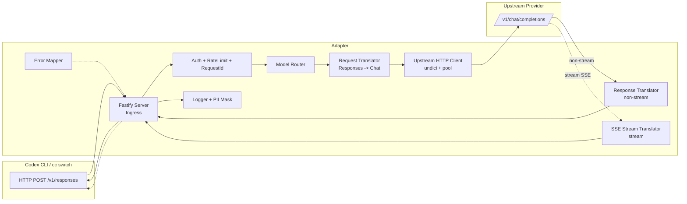

# Design Document

## Overview

`codex-responses-adapter`（下文简称 Adapter）是一个本地运行的 HTTP 协议中转服务。它对外暴露 OpenAI Codex CLI 所使用的 `/v1/responses` 协议，对内调用国内大模型厂商普遍提供的 OpenAI 兼容 `/v1/chat/completions` 协议。Adapter 的目标是让用户可以通过 `cc switch` 将 Codex CLI 的 API Base URL 指向 Adapter，进而在不修改 Codex 本体的前提下使用 DeepSeek、Qwen、GLM、Kimi、豆包、百川、MiniMax 等国产模型。

### 设计目标

1. **语义保真**：在 Responses 与 Chat Completions 两种协议之间保持字段语义等价，覆盖非流式响应、流式 SSE、工具调用（function/tool calling）、常用采样参数、system 消息。
2. **往返可验证**：请求/响应双向转换具备 round-trip 性质（Requirement 5），配置解析/序列化亦具备 round-trip 性质（Requirement 9.5），便于通过属性测试和录制回放验证协议一致性。
3. **本地安全默认**：客户端以本地 `Admin_Key` 鉴权，上游真实 API Key 不外泄；未配置 `Admin_Key` 时仅绑定回环地址。
4. **可运维**：结构化访问日志、`X-Request-Id`、PII 遮蔽、配置诊断命令、录制回放。
5. **低门槛部署**：Node.js 20+，npm 包分发，提供 Dockerfile。

### 非目标

- 不兼容 OpenAI Assistants API、Batch API、Files API、Realtime API。
- 不实现国内厂商非 OpenAI 兼容端点（例如 Qwen DashScope 原生协议、豆包原生 Ark 协议中不符合 OpenAI 兼容格式的部分）。这些协议需要各自单独的适配层，首版仅处理 `type=openai_compatible` 的 Provider。
- 不做模型能力自动路由/负载均衡，路由策略完全由请求中的 `model` 字段 + `Model_Mapping` 决定。
- 不承担多用户计费与配额控制。

### 关键研究发现

本节汇总 Adapter 设计所依赖的协议与生态知识，作为后续组件设计的依据。由于 OpenAI Responses API、SSE 事件名、各国产厂商 OpenAI 兼容端点均有公开文档，这里仅记录对设计有直接影响的要点，不做完整引用。

1. **OpenAI Responses API**（`POST /v1/responses`）请求体的关键字段：
   - `model`: 必填。
   - `input`: 必填；可为字符串，也可为结构化消息数组，每条消息包含 `role` 和 `content`；`content` 可以是字符串或富文本数组（`input_text` / `input_image` / `input_file` 等条目）。
   - `instructions`: 可选的 system 级别指令文本。
   - `tools`: 工具/函数定义数组，常见形态为 `{type: "function", name, description, parameters}`（parameters 为 JSON Schema）。
   - `tool_choice`: `"auto"` / `"none"` / `"required"` / `{type:"function", name:<N>}`。
   - `temperature`、`top_p`、`max_output_tokens`、`presence_penalty`、`frequency_penalty`: 常用采样参数。
   - `reasoning.effort`: reasoning 模型相关参数。
   - `stream`: 布尔。
2. **Responses 流式 SSE 事件名**（本 Adapter 必须产出）：
   - `response.created`
   - `response.output_item.added`
   - `response.output_text.delta`
   - `response.output_text.done`
   - `response.function_call_arguments.delta`
   - `response.function_call_arguments.done`
   - `response.output_item.done`
   - `response.completed`
   - `response.failed`
3. **OpenAI Chat Completions API**（`POST /v1/chat/completions`）请求体关键字段：
   - `model`、`messages`、`temperature`、`top_p`、`max_tokens`、`presence_penalty`、`frequency_penalty`、`tools`、`tool_choice`、`stream`。
   - 消息结构：`{role: "system"|"user"|"assistant"|"tool", content: string | content_parts[], tool_calls?, tool_call_id?}`。
   - 流式块按 `data: {json}\n\n` 发送，最终以 `data: [DONE]\n\n` 结尾。
4. **国产 OpenAI 兼容端点**（首版覆盖）：
   - DeepSeek：`https://api.deepseek.com/v1/chat/completions`。
   - 阿里 DashScope OpenAI 兼容：`https://dashscope.aliyuncs.com/compatible-mode/v1/chat/completions`。
   - 智谱 GLM：`https://open.bigmodel.cn/api/paas/v4/chat/completions`。
   - Moonshot Kimi：`https://api.moonshot.cn/v1/chat/completions`。
   - 百川、MiniMax、豆包（方舟 OpenAI 兼容端点）均提供标准 `messages` + `tools` + `stream` 兼容字段。
   - 兼容性分歧主要集中在：`tool_choice` 取值（部分厂商仅支持 `auto`/`none`）、`reasoning` 扩展字段名、视觉输入（多数不支持 `image_url`）。这些分歧由 `Provider_Profile.capabilities` 和 `reasoning_param_name` 表达。
5. **Node.js 生态选型**：
   - HTTP 框架：Fastify（比 Express 性能好，原生支持 JSON schema 校验，`onRequest`/`onResponse` 钩子便于日志与 request-id）。
   - YAML 解析：`yaml` 包（支持 round-trip 解析，便于 `config print`）。
   - JSON Schema 校验：`ajv`（业界事实标准，与 Fastify 原生集成）。
   - 上游 HTTP 客户端：`undici`（Node 原生 fetch 引擎，支持连接池、streaming、cancel signal）。
   - 属性测试：`fast-check`（Node 生态最成熟的 PBT 库）。
   - 单元测试：`vitest`（原生 TS、watch、快照、与 fast-check 兼容良好）。

## Architecture

Adapter 运行为单进程 Node.js HTTP 服务。整体上分为三层：

1. **HTTP 接入层**（Ingress）：监听本地端口，处理 Codex Responses 请求、`/v1/models`、`/healthz`。负责鉴权、并发限流、request-id 注入、访问日志。
2. **协议转换核心**（Core）：由 `Request_Translator`、`Response_Translator`、`SSE_Stream_Translator`、`Model_Router`、`Error_Mapper` 组成。纯函数/纯逻辑为主，便于做属性测试。
3. **出接层**（Egress）：基于 `undici` 的上游 HTTP 客户端，负责 Keep-Alive 连接池、超时、重试、cancel signal 传递。

### 架构图



### 主要数据流

**非流式请求**：
1. Ingress 收 POST `/v1/responses`，鉴权通过，分配 `request_id`。
2. 前置 JSON Schema 校验 Responses 请求体。
3. `Model_Router` 根据 `request.model`（或 `default_model`）查出 `Provider_Profile` 与真实模型 ID。
4. `Request_Translator` 将 Responses 请求转为 Chat Completions 请求（system 提升、input 展开、tools/tool_choice 翻译、参数映射、model 替换）。
5. `Upstream_Client` 带 Provider `api_key` 向上游发起 HTTP 请求，遵循超时/重试。
6. `Response_Translator` 将上游非流式响应转回 Responses 响应对象。
7. Ingress 以 JSON 响应客户端，写访问日志。

**流式请求**：
1. Ingress 以 `text/event-stream` 响应客户端，先写 `response.created` 事件。
2. `SSE_Stream_Translator` 维护一个"流式会话状态机"（`StreamingState`），解析上游 SSE `data:` 块。
3. 每个 Chat Completions delta 被翻译为零或多个 Responses 事件（`output_text.delta`、`function_call_arguments.delta` 等）。
4. 仅在上游显式给出 `finish_reason != null` 之后才发送 `response.output_item.done` 与 `response.completed`。
5. 上游中断或错误时，发送 `response.failed` 事件，并启用"未投递错误补投"机制（见错误处理章节）。
6. 客户端断开时，`AbortController` 向上游广播取消信号，在 1 秒内释放资源。

### 模块边界

- **纯函数模块**（易于属性测试）：`Request_Translator`、`Response_Translator`（非流式部分）、`SSE_Stream_Translator`（以 `(state, chunk) -> (state', events[])` 形式实现的状态机）、`Error_Mapper`、`Config_Parser` + `Config_PrettyPrinter`。
- **IO 模块**（用 mock 做集成测试）：`Upstream_Client`、Fastify 路由、`FileSystem` 录制写入。
- **横切关注点**：`Logger`（pino）、`PII_Masker`、`RequestId_Middleware`、`Auth_Middleware`、`Concurrency_Limiter`。

### 设计决策与理由

| 决策 | 备选 | 选定 | 理由 |
|------|------|------|------|
| 运行时 | Go / Rust / Python / Node | Node.js 20+ | 与 Codex CLI 同生态，SSE 处理成熟，JSON 协议调试便捷（Req 13.1） |
| HTTP 框架 | Express, Koa, 原生 http | Fastify | 内置 JSON Schema 校验、性能好、hook 模型清晰 |
| 上游客户端 | `node-fetch`, `axios`, `got` | `undici` | 原生支持连接池与流式 body，abort signal 成熟 |
| 配置格式 | JSON / TOML | YAML | 用户编辑友好，注释能力好，与同类工具一致 |
| 属性测试框架 | jsverify, fast-check | `fast-check` | 活跃度最高、TS 支持好、shrinker 完备 |
| SSE 状态管理 | 事件总线 / RxJS | 显式状态机（pure function） | 便于 PBT，状态可重放可比较 |

## Components and Interfaces

### HTTP 接入层（Ingress）

`Ingress` 由 Fastify 实例承载，注册如下路由：

- `POST /v1/responses` → `handleResponsesRequest`
- `GET /v1/models` → `handleListModels`
- `GET /healthz` → `() => { status: "ok" }`
- `ALL /v1/responses` 除 POST 之外的方法 → 405（由 Fastify `onRoute` 捕获，保证 Req 1.5）

全局 hooks：
- `onRequest`: 分配 `request_id`，写入 `reply.headers['X-Request-Id']`，附着到 log context。
- `preHandler` 顺序：`AuthMiddleware` → `ConcurrencyLimiter`。
- `onResponse`: 记录访问日志（`request_id`、`model`、`provider`、`stream`、`status_code`、`latency_ms`）。
- `setErrorHandler`: 统一错误转 OpenAI 风格 JSON 错误体。

**接口草图**：

```ts
type ResponsesRequest = {
  model: string;
  input: string | InputMessage[];
  instructions?: string;
  tools?: FunctionTool[];
  tool_choice?: ToolChoice;
  temperature?: number;
  top_p?: number;
  max_output_tokens?: number;
  presence_penalty?: number;
  frequency_penalty?: number;
  reasoning?: { effort?: "low" | "medium" | "high" };
  stream?: boolean;
};

async function handleResponsesRequest(req, reply): Promise<void>;
```

### AuthMiddleware

```ts
function authMiddleware(config: Config): FastifyPreHandler {
  // - path === "/healthz"  → 放行
  // - 若 config.admin_key 为空 → 仅允许 remoteAddress 为 127.0.0.1/::1 的连接（Req 7.5）
  // - 否则要求 Authorization: Bearer <admin_key>，不等值 → 401 invalid_api_key（严格字段集合：message, type, param, code）
}
```

### ConcurrencyLimiter

- 维护一个单调计数器 `inFlight`，配合 `listen.max_concurrency`（默认 64）。
- 超过阈值：构造 OpenAI 风格 503 错误体，`error.type=adapter_overloaded`。
- 若写入客户端失败（连接已断）：仍然发一条本地 `error.type=adapter_overloaded` 的 log（Req 11.2 可观测性）。

### Model Router

```ts
type Config = {
  listen: { host: string; port: number; max_concurrency?: number };
  admin_key?: string;
  default_model?: string;
  log: { level: "info"|"debug"|"warn"|"error"; record_bodies?: boolean; record_dir?: string };
  providers: ProviderProfile[];
  model_mappings: ModelMapping[];
};

type ProviderProfile = {
  name: string;
  type: "openai_compatible";
  base_url: string;
  api_key: string;
  models: string[];
  capabilities: { vision?: boolean; reasoning?: boolean };
  reasoning_param_name?: string; // Req 2.10
  timeout_ms?: number;           // default 60000
  max_retries?: number;          // default 2
  max_connections?: number;      // default 16
};

type ModelMapping = {
  alias: string;        // Codex 请求中的 model 值
  provider: string;     // 对应 ProviderProfile.name
  upstream_model: string;
};

function resolveModel(req: ResponsesRequest, cfg: Config): { profile: ProviderProfile; upstreamModel: string };
```

路由逻辑：
1. 若 `req.model` 缺失/空串 且 `cfg.default_model` 存在 → 用 `default_model` 替换。
2. 在 `cfg.model_mappings` 中按 `alias === req.model` 精确查找，拿到 `provider` 与 `upstream_model`。
3. 未命中 → 抛出 `ModelNotFoundError`（映射为 HTTP 404 + `error.type=model_not_found`，Req 6.4）。

### Request Translator

核心纯函数，签名：

```ts
function translateRequest(
  req: ResponsesRequest,
  profile: ProviderProfile,
  upstreamModel: string,
  logger: Logger
): ChatCompletionsRequest;
```

主要步骤（编号对应 Req 2）：

1. 初始化 `messages = []`。
2. 若 `req.instructions` 非空 → `messages.push({role:"system", content: req.instructions})`（Req 2.1）。
3. 展开 `req.input`：
   - string → `messages.push({role:"user", content: req.input})`（Req 2.2）。
   - array → 按顺序，每条 `{role, content}` 翻译：
     - `content` 为字符串 → 直接赋值。
     - `content` 为富文本数组：
       - `input_text` → 文本合并到 `content` 字符串（保序，Req 2.4）。
       - `input_image`：若 `profile.capabilities.vision === true` → 转为 `{type:"image_url", image_url:{url}}`（Req 2.5），此时 `content` 取 part 数组；否则丢弃并 `logger.warn`（Req 2.6）。
4. 翻译 `tools`：仅保留 `type==="function"`，映射为 `{type:"function", function:{name, description, parameters}}`（Req 2.7）。
5. 翻译 `tool_choice`（Req 2.8）。
6. 映射采样参数（Req 2.9），其中 `max_output_tokens → max_tokens`。
7. 翻译 `reasoning.effort`：若 `profile.reasoning_param_name` 存在 → 在输出对象上以该 key 附加 `req.reasoning.effort` 值；否则省略（Req 2.10）。
8. `model = upstreamModel`（Req 2.11）。
9. 保留 `stream`。

### Upstream HTTP Client

基于 `undici.Pool`（每个 `ProviderProfile` 独立的连接池，`max_connections` 控制并发，Req 11.3）。

```ts
class UpstreamClient {
  constructor(profile: ProviderProfile);
  send(request: ChatCompletionsRequest, opts: { signal: AbortSignal; requestId: string }): Promise<
    | { kind: "non_stream"; body: ChatCompletionsResponse; statusCode: number }
    | { kind: "stream"; sse: AsyncIterable<ChatSseChunk>; statusCode: number }
    | { kind: "error"; statusCode: number; bodyText: string }
  >;
}
```

- 非流式：`max_retries` 次指数退避重试，退避毫秒数 `min(500 * 2^(n-1), 4000)`（Req 8.4）。
- 流式：不自动重试（Req 8.5）。
- 超时：`timeout_ms` 控制首字节到达前的最大等待（headers 超时）；超时后主动 abort，返回 504 `upstream_timeout`（Req 8.3）。晚到响应被丢弃。

### Response Translator（非流式）

```ts
function translateResponse(
  upstream: ChatCompletionsResponse,
  ctx: { model: string; requestId: string; createdAt: number }
): ResponsesObject;
```

主要步骤（对应 Req 3）：
1. 断言 `choices[0].message` 存在，否则抛 `UpstreamShapeError` → 502（Req 3.6）。
2. 构造 `output` 数组：
   - 若 `message.content` 非空 → push `{type:"message", status, content:[{type:"output_text", text: message.content}]}`。
   - 每个 `tool_calls[i]` → push `{type:"function_call", call_id: tool_calls[i].id, name: tool_calls[i].function.name, arguments: tool_calls[i].function.arguments}`。
3. 映射 `usage`：`prompt_tokens → input_tokens`，`completion_tokens → output_tokens`，`total_tokens → total_tokens`（Req 3.4）。
4. 映射 `finish_reason`：
   - `stop` → `completed`
   - `length` → `incomplete`
   - `tool_calls` → `completed`
   - `content_filter` → `incomplete`
   - 其他/缺失 → `completed`
   
   映射纯按 finish_reason 计算，与 `completion_tokens` 无关（Req 3.5）。

### SSE Stream Translator

以显式状态机实现，便于属性测试：

```ts
type StreamingState = {
  responseId: string;
  model: string;
  textItem?: { itemId: string; text: string; opened: boolean; closed: boolean };
  toolCalls: Map<number /* choice index */, ToolCallAccumulator>;
  completedSent: boolean;
};

type ToolCallAccumulator = {
  itemId: string;
  callId: string;
  name: string;
  argsBuffer: string;
  openedItemSent: boolean;
  doneSent: boolean;
};

function stepStream(
  state: StreamingState,
  chunk: ChatSseChunk | "upstream_error" | "upstream_end"
): { state: StreamingState; events: ResponsesEvent[] };
```

状态机规则（对应 Req 4）：
- **初始**：产出 `response.created`（`status="in_progress"`），然后继续消费 chunk。
- **文本增量**：`chunk.choices[0].delta.content` 非空 →
  - 若文本 item 尚未开启 → 先发 `response.output_item.added`（type=message）
  - 发 `response.output_text.delta`，`data.delta = <增量文本>`（Req 4.3）。
- **工具调用增量**：`chunk.choices[0].delta.tool_calls[i].function.arguments` 有增量 →
  - 若该 item 未开启 → 先发 `response.output_item.added`（type=function_call）
  - 发 `response.function_call_arguments.delta`（Req 4.4），`item_id` 在同一 tool_call 索引内保持稳定。
- **工具调用结束**：上游给出 `finish_reason = "tool_calls"` 或在下一个 chunk 进入新 tool_call 索引 → 发 `response.function_call_arguments.done`（Req 4.5）。
- **整体完成**：仅当上游显式 `finish_reason != null` → 依次发 `response.output_text.done`（若有文本 item）、`response.output_item.done`（逐个）、`response.completed`（Req 4.6）。
- **错误分支**：若遇 `upstream_error` → 发 `response.failed`；此时客户端写入采用"先序列化为字节缓冲 → 写入 → flush → 关闭"的强化流程（Req 4.9）。若写入失败，将该错误事件以 `request_id` 为键登记到 `FailedEventReplayStore`，TTL 60s。下一次使用同一 `request_id` 的请求在首个事件之前补投。

### Error Mapper

```ts
function mapUpstreamError(upstreamStatus: number, bodyText: string): OpenAIError;
```

映射（Req 8.1）：401 → `invalid_api_key`；403 → `permission_error`；404 → `model_not_found`；429 → `rate_limit_error`；其他 4xx → `invalid_request_error`；5xx → `upstream_error`（整体响应码 502）。

### Logger & PII Masker

- `pino` 作为 JSON 结构化 logger。
- `PII_Masker` 对 message content 中的邮箱、手机号（E.164 / 中国 11 位）、信用卡号（Luhn 的长度近似，13-19 位数字）进行正则替换为 `***`（Req 10.5）。
- `admin_key` 与 `provider.api_key` 在日志、`config print`、错误体、诊断输出中统一脱敏为 `abcd...wxyz`（前 4 + 省略号 + 后 4，Req 7.4）。

### Config Parser + Pretty Printer

```ts
function parseConfig(text: string): Config;          // yaml → object → JSON Schema 校验
function prettyPrintConfig(cfg: Config): string;     // 字段字典序、2 空格缩进
```

- Round-trip 协约：`parse(prettyPrint(parse(t))) ≡ parse(t)`（Req 9.5）。
- `adapter config check <path>` 实现 `parse → schema validate → pretty-print → parse → deep equal`，失败时打印差异路径。
- 未识别字段在启动日志中以 `warning` 级输出（Req 9.6），通过 Ajv 的 `additionalProperties: true` + 自定义钩子收集未知字段。

### CLI

`codex-responses-adapter` 使用 `commander` 实现：
- `start [--config <path>]`
- `config print [--config <path>]`
- `config check <path>`
- `validate --record <path>`

## Data Models

### Config 文件（YAML）

```yaml
listen:
  host: 127.0.0.1
  port: 8787
  max_concurrency: 64
admin_key: "local-xxxx"
default_model: "codex-default"
log:
  level: info
  record_bodies: false
  record_dir: "~/.codex-responses-adapter/records"
providers:
  - name: deepseek
    type: openai_compatible
    base_url: "https://api.deepseek.com/v1"
    api_key: "sk-xxx"
    models: ["deepseek-chat", "deepseek-reasoner"]
    capabilities: { vision: false, reasoning: true }
    reasoning_param_name: "reasoning_effort"
    timeout_ms: 60000
    max_retries: 2
    max_connections: 16
model_mappings:
  - alias: "codex-default"
    provider: "deepseek"
    upstream_model: "deepseek-chat"
  - alias: "gpt-4o"
    provider: "deepseek"
    upstream_model: "deepseek-chat"
```

### Responses 请求内部表示（TS 类型草图）

```ts
type InputMessage = {
  role: "user" | "assistant" | "system" | "tool";
  content: string | InputContentPart[];
  tool_call_id?: string;
};

type InputContentPart =
  | { type: "input_text"; text: string }
  | { type: "input_image"; image_url: string };

type FunctionTool = {
  type: "function";
  name: string;
  description?: string;
  parameters: JSONSchema;
};

type ToolChoice =
  | "auto" | "none" | "required"
  | { type: "function"; name: string };
```

### Chat Completions 内部表示

```ts
type ChatMessage =
  | { role: "system" | "user"; content: string | ChatContentPart[] }
  | { role: "assistant"; content: string | null; tool_calls?: ChatToolCall[] }
  | { role: "tool"; content: string; tool_call_id: string };

type ChatContentPart =
  | { type: "text"; text: string }
  | { type: "image_url"; image_url: { url: string } };

type ChatToolCall = {
  id: string;
  type: "function";
  function: { name: string; arguments: string /* JSON string */ };
};
```

### Responses 响应对象（非流式）

```ts
type ResponsesObject = {
  id: string;
  object: "response";
  created_at: number;
  status: "completed" | "incomplete" | "in_progress" | "failed";
  model: string;
  output: ResponsesOutputItem[];
  usage: { input_tokens: number; output_tokens: number; total_tokens: number };
};

type ResponsesOutputItem =
  | { id: string; type: "message"; status: "completed"|"incomplete"; content: [{type:"output_text"; text:string}] }
  | { id: string; type: "function_call"; status: "completed"; call_id: string; name: string; arguments: string };
```

### SSE 事件联合类型

```ts
type ResponsesEvent =
  | { event: "response.created";                       data: { response: ResponsesObject /* status=in_progress */ } }
  | { event: "response.output_item.added";             data: { item: ResponsesOutputItem; output_index: number } }
  | { event: "response.output_text.delta";             data: { item_id: string; delta: string; output_index: number } }
  | { event: "response.output_text.done";              data: { item_id: string; text: string; output_index: number } }
  | { event: "response.function_call_arguments.delta"; data: { item_id: string; delta: string; output_index: number } }
  | { event: "response.function_call_arguments.done";  data: { item_id: string; arguments: string; output_index: number } }
  | { event: "response.output_item.done";              data: { item: ResponsesOutputItem; output_index: number } }
  | { event: "response.completed";                     data: { response: ResponsesObject } }
  | { event: "response.failed";                        data: { response: { id: string; status: "failed"; error: OpenAIError } } };
```

### 统一错误对象（Req 7.2 / Req 8）

```ts
type OpenAIError = {
  message: string;   // 非空
  type: "invalid_request_error" | "invalid_api_key" | "permission_error"
      | "model_not_found" | "rate_limit_error" | "upstream_error"
      | "upstream_timeout" | "adapter_overloaded" | "adapter_internal_error";
  param: string | null;
  code: string | null;
};
```

响应体格式：`{ "error": OpenAIError }`，`Content-Type: application/json; charset=utf-8`。

### 录制文件格式

以 NDJSON 形式按 `request_id` 分块，字段：
- `recorded_at`、`request_id`、`direction`（`client_in` | `upstream_out` | `upstream_in` | `client_out`）、`body`（已做 PII 脱敏的 JSON 或 SSE 文本）。
- `validate --record <path>` 读取一个录制文件，按 `request_id` 分组，驱动 round-trip 校验（Req 5.4）。


## Correctness Properties

*属性（property）是在系统所有合法执行下都应成立的一条特征或行为——本质上是关于系统"应该做什么"的形式化陈述。属性是人类可读的规约和机器可验证的正确性保证之间的桥梁。*

本节的每一条属性均来自于上文 prework 阶段的分析（已在工具中登记），并采用"全称量化 + 所验证的需求条款"的标注格式。经过 Property Reflection 之后，同类字段级翻译规则已归并到请求/响应往返属性（Property 1、2、3）中；只有那些无法被往返属性蕴含的独立不变量单独列出。

### Property 1: Responses 请求到 Chat Completions 请求的往返等价

*For any* 合法的 Responses 请求对象 `req` 与合法的 `ProviderProfile` / `upstream_model`，执行 `responses_to_chat(req) → chat_to_responses` 得到的对象 `req'`，在字段集合 `{model（经 Model_Mapping 还原后的 alias）, instructions, input 的文本内容, tools, tool_choice, temperature, top_p, max_output_tokens, presence_penalty, frequency_penalty}` 上与 `req` 等价。

**Validates: Requirements 2.1, 2.2, 2.3, 2.4, 2.7, 2.8, 2.9, 2.11, 5.1**

### Property 2: Chat Completions 非流式响应到 Responses 响应的往返等价

*For any* 合法的 Chat Completions 非流式响应对象 `upstream`，执行 `chat_to_responses(upstream) → responses_to_chat` 得到的对象 `upstream'`，在字段集合 `{message.content, tool_calls, finish_reason, usage}` 上与 `upstream` 等价。

**Validates: Requirements 3.1, 3.2, 3.3, 3.4, 5.2**

### Property 3: 流式到非流式的重建等价

*For any* 合法的上游流式事件序列 `stream`，以及与之语义等价的非流式 Chat Completions 响应 `nonStream`，由 Adapter 流式翻译并按增量累积重建出的 Responses 对象 `R_stream`，与 `translateResponse(nonStream)` 得到的 Responses 对象 `R_direct` 在字段集合 `{output 中所有 message 的文本拼接, output 中所有 function_call 的 (call_id, name, arguments) 集合}` 上等价。

**Validates: Requirements 4.3, 4.4, 4.5, 5.3**

### Property 4: 流式结束信号不可推断

*For any* 上游流式事件序列，若所有已到达 chunk 的 `choices[0].finish_reason` 均为 `null`，则 Adapter 不得发出 `response.output_item.done` 或 `response.completed` 事件。

**Validates: Requirements 4.6**

### Property 5: 流式事件 `item_id` 稳定性

*For any* 上游流式事件序列，对任一出现在 `choices[0].delta.tool_calls` 中的索引 `i`，Adapter 为该 `i` 产出的 `response.function_call_arguments.delta` 与 `response.function_call_arguments.done` 事件的 `item_id` 在整个流中取值始终相同，且不同索引之间的 `item_id` 互不相同。

**Validates: Requirements 4.4, 4.5**

### Property 6: finish_reason 到 status 的映射独立于 token 计数

*For any* 合法上游响应 `upstream`，`translateResponse(upstream).status` 仅由 `upstream.choices[0].finish_reason` 决定，与 `upstream.usage.completion_tokens` 的取值无关。具体映射为：`stop→completed`、`length→incomplete`、`tool_calls→completed`、`content_filter→incomplete`。

**Validates: Requirements 3.5**

### Property 7: reasoning.effort 条件映射

*For any* 请求 `req` 与 `ProviderProfile` `p`：
- 若 `req.reasoning.effort` 存在且 `p.reasoning_param_name = K` 非空，则翻译输出对象在键 `K` 上的值等于 `req.reasoning.effort`；
- 否则翻译输出对象不得包含任何以 reasoning 形式附加的字段。

**Validates: Requirements 2.10**

### Property 8: 请求前置校验的完备性

*For any* 请求对象 `req`，若 `req` 违反以下任一约束——JSON 合法性、`model` 字段存在且非空、`input` 字段存在且类型为字符串或数组、所有 `tools[].function.name` 非空——则 Adapter 返回 HTTP 400，响应体为 OpenAI 风格错误，`error.type = "invalid_request_error"`；且当多条约束同时被违反时，仍只返回一个 400 响应。

**Validates: Requirements 2.12, 2.13**

### Property 9: 模型路由的全面性

*For any* 合法的 `Config` `cfg` 与任意请求 `req`：
- 若 `req.model` 非空且存在于 `cfg.model_mappings`，则 `resolveModel(req, cfg)` 返回对应的 `(profile, upstream_model)`；
- 若 `req.model` 为空或缺失，且 `cfg.default_model` 存在于 mappings，则 `resolveModel` 返回 `default_model` 对应的映射；
- 若 `req.model` 非空且未在 mappings 中，或 `req.model` 为空且 `cfg.default_model` 未配置/未在 mappings 中，则 Adapter 返回 HTTP 404，`error.type = "model_not_found"`。

**Validates: Requirements 6.2, 6.3, 6.4**

### Property 10: 上游鉴权来源的单一性

*For any* 配置 `cfg` 与入站请求 `req_in`，Adapter 向上游发出的任意 HTTP 请求的 `Authorization` 头部取值恒等于被路由到的 `ProviderProfile.api_key`（以 `Bearer` 方案），并且上游请求中不得出现 `cfg.admin_key` 的任何子串。

**Validates: Requirements 6.6, 7.3**

### Property 11: 本地鉴权与错误体严格形状

*For any* 请求 `req_in`，当 `cfg.admin_key` 非空且 `req_in.path != "/healthz"`：
- 若 `req_in` 的 `Authorization` 头部不等于 `Bearer <admin_key>`，Adapter 返回 HTTP 401；
- 响应体为顶层对象 `{ "error": E }`，`E` 恰好包含字段 `message`（非空字符串）、`type = "invalid_api_key"`、`param`（字符串或 null）、`code`（字符串或 null）；
- 响应 `Content-Type` 为 `application/json; charset=utf-8`。

**Validates: Requirements 7.1, 7.2**

### Property 12: 密钥脱敏格式

*For any* 被视为密钥的字符串 `s`（`admin_key`、`provider.api_key`），其在日志、`config print` 输出、诊断命令输出、错误体中出现时，取值形式为 `s[0..3] + "..." + s[-4..]`；当 `len(s) <= 8` 时，完全替换为 `***`。

**Validates: Requirements 7.4**

### Property 13: 上游错误状态码到 OpenAI 错误类型的映射

*For any* 上游响应状态码 `c`：
- `c == 401 → error.type = "invalid_api_key"`；
- `c == 403 → error.type = "permission_error"`；
- `c == 404 → error.type = "model_not_found"`；
- `c == 429 → error.type = "rate_limit_error"`；
- 其他 `400 <= c < 500 → error.type = "invalid_request_error"`，透传状态码；
- `500 <= c < 600 → HTTP 502, error.type = "upstream_error"`，且 `error.message` 包含上游原始消息的内容。

**Validates: Requirements 8.1, 8.2, 3.6**

### Property 14: 指数退避重试调度表

*For any* `max_retries = N ∈ [0, 10]` 与非流式请求，若上游持续返回 429 或 5xx，则 Adapter 发出的第 `n` 次重试（`1 <= n <= N`）之前的退避时长等于 `min(500 * 2^(n-1), 4000)` 毫秒；总调用次数不超过 `N + 1`。对于 `stream = true` 的请求，无论上游返回何种错误，上游调用次数恒为 1。

**Validates: Requirements 8.4, 8.5**

### Property 15: 超时与晚到响应丢弃

*For any* `timeout_ms = T` 与延迟 `D` 的上游首字节：
- 若 `D > T`，Adapter 在 `T` 毫秒时返回 HTTP 504、`error.type = "upstream_timeout"`；
- 并且即便上游随后（在 Adapter 已发出 504 之后）到达，客户端已接收到的结果不被改写。

**Validates: Requirements 8.3**

### Property 16: `response.failed` 事件补投窗口

*For any* 在时间 `t` 于 `request_id = R` 上被记录的上游失败事件 `F`，以及任意后续来自客户端、以同一 `R` 为 `X-Request-Id` 的请求，若该后续请求在时间 `t + Δ`（`Δ <= 60s`）到达，则 Adapter 向该请求发送的首个事件恰为 `F`；若 `Δ > 60s`，则不补投。每个 `F` 至多被补投一次。

**Validates: Requirements 4.8, 4.9**

### Property 17: 配置 round-trip

*For any* 合法的 `Config` 对象 `cfg` 与其序列化文本 `t = prettyPrint(cfg)`，`parse(t)` 得到的对象与 `cfg` 在全部字段上等价；反向地，对任意合法 `Config` YAML 文本 `t_in`，`parse(prettyPrint(parse(t_in))) ≡ parse(t_in)`，且 `prettyPrint` 输出按每一层字段名字典序排序、使用 2 空格缩进。

**Validates: Requirements 9.4, 9.5**

### Property 18: 配置校验失败必定非零退出

*For any* 不符合 JSON Schema 的 `Config` 文本输入，Adapter 进程退出码为非零，并在标准错误输出第一条错误的字段路径与原因；此不变量在校验失败之后即使发生次生错误也必须保持（需求条款 9.3a 与 9.3b 的泛化启动失败/退出码鲁棒性亦由本属性覆盖）。

**Validates: Requirements 9.3**

### Property 19: 未识别字段仅产生 warning

*For any* 合法 `Config` 基础上附加任意额外字段路径 `P`（不在 schema 中），Adapter 仍能成功启动，并在启动日志中输出一条 `level = warning` 且消息包含路径 `P` 的日志。

**Validates: Requirements 9.6**

### Property 20: `X-Request-Id` 形状与唯一性

*For any* 在一次 Adapter 进程生命期内到达的请求集合 `R`，每个请求在响应头 `X-Request-Id` 中返回的值匹配 UUID v4 的正则（`^[0-9a-f]{8}-[0-9a-f]{4}-4[0-9a-f]{3}-[89ab][0-9a-f]{3}-[0-9a-f]{12}$`），且 `R` 中任意两个请求的 `request_id` 互不相同。

**Validates: Requirements 10.1**

### Property 21: 访问日志字段完备

*For any* 完成生命周期的入站请求，Adapter 输出的访问日志条目为 JSON 结构，包含字段集合 `{request_id, model, provider, stream, status_code, latency_ms}`，且 `status_code` 与 `latency_ms` 与实际响应一致。

**Validates: Requirements 10.2**

### Property 22: PII 遮蔽

*For any* 原始日志消息文本 `m`，`mask(m)` 满足：
- `m` 中所有匹配邮箱正则、中国大陆手机号（11 位）、E.164 手机号、13-19 位连续数字（信用卡号近似）的子串在输出中均被替换为 `***`；
- `mask(m)` 中不包含上述模式的任何匹配。

**Validates: Requirements 10.5**

### Property 23: 并发过载错误语义可观测

*For any* 入站请求序列，当处于在途的请求数超过 `listen.max_concurrency` 时，被拒绝的请求满足：响应为 HTTP 503、错误体 `error.type = "adapter_overloaded"`；若写入客户端失败，则本地日志中仍能观测到一条结构化过载事件（`error.type = "adapter_overloaded"`）。

**Validates: Requirements 11.2**

## Error Handling

错误处理分三层：

### 1. 入站/本地错误（Adapter 自身产生）

- **请求体 JSON 非法 / 前置校验失败** → HTTP 400，`error.type = "invalid_request_error"`（Req 2.12/2.13，Property 8）。
- **鉴权失败** → HTTP 401，严格 OpenAI 错误体（Req 7.2，Property 11）。
- **模型未知** → HTTP 404，`error.type = "model_not_found"`（Req 6.4，Property 9）。
- **并发过载** → HTTP 503，`error.type = "adapter_overloaded"`（Req 11.2，Property 23）。
- **未捕获异常** → HTTP 500，`error.type = "adapter_internal_error"`，完整堆栈写本地 log（Req 8.6）。
- **方法不支持** → HTTP 405（Req 1.5）。

### 2. 上游错误

- 4xx → 按 Property 13 映射，透传状态码。
- 5xx → HTTP 502，`error.type = "upstream_error"`，保留原始 `message`。
- 非流式请求在 429/5xx 上最多 `max_retries` 次指数退避重试（Property 14）。
- 首字节超时 → HTTP 504，`error.type = "upstream_timeout"`（Property 15）；晚到的上游响应被丢弃。
- 上游响应形状非法（缺失 `choices` / `message=null`） → HTTP 502 `upstream_error`（Req 3.6）。

### 3. 流式错误

- `stream=true` 时：已经发出 `text/event-stream` header 的情况下不能改状态码，改为发送 `event: response.failed` 事件（Req 4.8）。
- `response.failed` 投递执行强化流程（Req 4.9）：序列化到字节缓冲 → 写客户端 → flush → close；失败则登记到 `FailedEventReplayStore`，键为 `request_id`，TTL 60 秒。
- 下一个使用相同 `request_id` 的请求到来时，首个事件即为被登记的 `response.failed`（Property 16）。
- 流式请求永不重试（Req 8.5，Property 14 后半）。
- 客户端断开时发送 abort signal 给上游，1 秒内释放资源（Req 4.7）。

### 4. 错误体规范（统一）

所有错误响应体满足 `{ "error": OpenAIError }`，`OpenAIError` 的 `type` 取值属于 `Data Models` 中枚举；`message` 非空；`param` 与 `code` 可为 null。除流式已发出 header 的情况外，`Content-Type` 均为 `application/json; charset=utf-8`。

### 5. 错误日志

- 401/404/400 等客户端错误 → `info` 级日志。
- 5xx 上游错误 → `warn` 级日志。
- 500 内部异常 → `error` 级日志 + 完整堆栈。
- `request_id` 始终在日志上下文中。
- 错误体中的密钥、PII 按 Property 12 / Property 22 规则处理。

## Testing Strategy

### 总体方针

采用"双轨测试"：
- **单元测试**：覆盖具体样例、边界条件、错误分支，快速定位缺陷；
- **属性测试**：通过随机输入覆盖广阔输入空间，验证上文 `Correctness Properties` 中的每一条。

两类测试互补。单元测试不追求覆盖所有输入组合（由属性测试负责），而专注于：
- 文档级别的"经典请求样例"（e.g. 真实 Codex CLI 抓包报文）；
- 上游响应的关键具体样例（DeepSeek、Qwen、GLM 等各一条非流式 + 一条流式录制）；
- CLI 子命令 happy-path。

### 工具选型

- **测试运行器**：`vitest`。单命令执行：`npx vitest --run`。
- **属性测试库**：`fast-check`。每个属性测试最少运行 100 次（`{ numRuns: 100 }`），部分涉及状态机/复杂结构的提升到 200–500。
- **HTTP mock**：`undici` 的 `MockAgent` 拦截出接层，便于断言 outgoing header、body、call count、重试间隔。
- **时间 mock**：`vi.useFakeTimers()` 配合 `sinon` 风格的 `clock.tickAsync`，用于超时与退避调度属性。
- **快照**：用于 `config print` 的具体样例，不用于 Responses 响应（响应结构由属性测试覆盖）。

### 属性测试规范

每个属性实现为**一个**属性测试（Req 1:1 映射），并用注释标注来源：

```ts
// Feature: codex-responses-adapter, Property 1: Responses 请求到 Chat Completions 请求的往返等价
it("property 1: responses_to_chat round-trips on specified fields", () => {
  fc.assert(
    fc.property(
      arbResponsesRequest(),
      arbProviderProfile(),
      (req, profile) => {
        const chat = translateRequest(req, profile, "upstream-id", stubLogger);
        const back = chatToResponsesForRoundTrip(chat);
        expect(projectFields(back)).toEqual(projectFields(req));
      }
    ),
    { numRuns: 200 }
  );
});
```

生成器（arbitraries）组织：
- `arbResponsesRequest()`: 覆盖字符串/数组 input、纯文本/富文本 content、有无 instructions、随机 tools/tool_choice、采样参数随机子集、有无 reasoning.effort。
- `arbChatCompletionsResponse()`: 覆盖含 content、含 tool_calls、两者混合、usage 随机、各 finish_reason。
- `arbUpstreamStream()`: 生成合法的 Chat Completions SSE chunk 序列，可注入 mid-stream error、多 tool_call 索引、最终 finish_reason。
- `arbConfig()`: 合法 Config；`arbConfigWithViolation()`：带一处 schema 违规。

状态机属性（Property 3、4、5、16、23）使用 `fc.commands` / `fc.scheduler`：生成一串"指令"，在模型与真实实现上并行执行，比较最终状态。

### 非 PBT 测试

- **集成测试**：HTTP 端到端（Fastify inject + mocked undici），用于 Property 4.7（客户端断开）、Req 11.1 并发、Req 11.4 优雅关停、Req 12.3 文档存在、Req 13.x 打包。
- **CLI 测试**：通过 `execa` 执行构建出的 bin，断言子命令返回码与输出片段。
- **Smoke 测试**：Req 1.4 healthz 延迟、Req 7.5 绑回环、Req 13.3 docker build（CI）。

### 覆盖率目标

- 协议转换核心模块（`Request_Translator`、`Response_Translator`、`SSE_Stream_Translator`、`Error_Mapper`、`Config_Parser`、`Config_PrettyPrinter`）语句覆盖率 ≥ 95%。
- 其他模块 ≥ 80%。
- 属性测试须覆盖 `Correctness Properties` 全部 23 条，各属性单独一个测试用例。

### CI 流水线

- PR：`npx tsc --noEmit && npx vitest --run && npx eslint .`。
- Nightly：属性测试放大到 `numRuns: 1000`；`adapter validate --record` 跑仓库录制样本目录；docker build。

